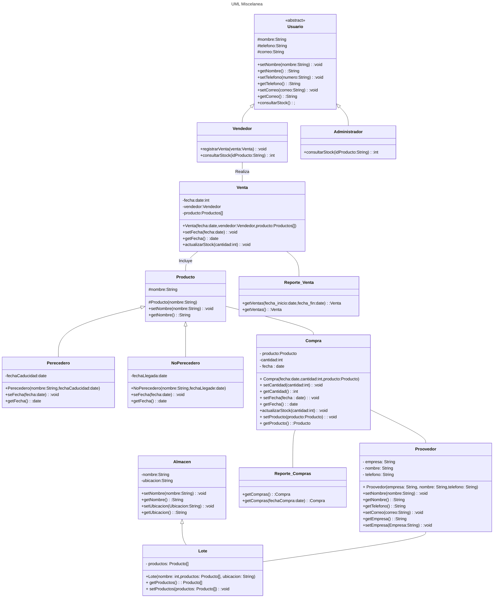
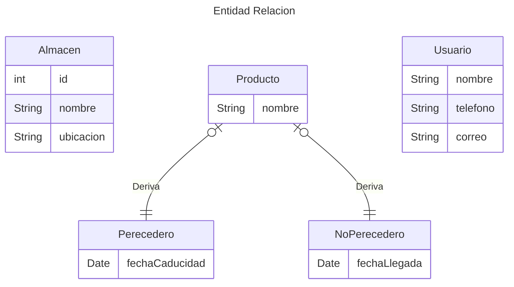

# Inventario-Miscelanea
Proyecto de Conmutación

# Planteamiento

En las misceláneas se presenta un problema recurrente al momento de buscar productos almacenados, ya sea en la bodega o en un almacén. La falta de organización y orden genera complicaciones, sobre todo con los productos perecederos que requieren venderse en un tiempo determinado para evitar pérdidas económicas.

Actualmente, el negocio lleva el control de inventario de manera manual o mediante herramientas básicas como hojas de cálculo. Este enfoque presenta varias limitaciones que afectan la eficiencia operativa. El registro, seguimiento y análisis del inventario consumen demasiado tiempo del personal, lo que resta atención a tareas clave como la atención al cliente o la planificación de compras. Además, el control manual es propenso a errores como registros duplicados, omisiones o discrepancias en las cantidades de productos, lo que provoca faltantes o sobrantes de mercancía.

Otro problema importante es la falta de un sistema que alerte sobre niveles bajos de stock, lo que ocasiona quiebres de inventario, afectando la satisfacción del cliente y, en algunos casos, la pérdida de los mismos. También resulta difícil conocer el estado real del inventario en tiempo oportuno, lo que limita la toma de decisiones rápidas, como el reabastecimiento de productos o la identificación de tendencias de venta que ayuden al crecimiento del negocio.

A esto se suma la falta de control de proveedores. Sin un registro adecuado de los proveedores y de sus condiciones de abastecimiento, se dificulta la gestión de compras, los tiempos de entrega y la negociación de precios. Esto puede derivar en retrasos en el reabastecimiento, sobrecostos o dependencia de un solo proveedor.



┌──────────────────────┐
│       Usuario        │
├──────────────────────┤
│ - nombre: String     │
│ - telefono: String   │
│ - correo: String     │
├──────────────────────┤
│ + setNombre()        │
│ + getNombre()        │
│ + setTelefono()      │
│ + getTelefono()      │
│ + setCorreo()        │
│ + getCorreo()        │
│ + consultarStock()   │
└─────────▲────────────┘
│
│ hereda
│
┌─────────┴────────────┐    ┌──────────────────────┐
│      Vendedor        │    │    Administrador     │
├──────────────────────┤    ├──────────────────────┤
│ - idVendedor: int    │    │ - idAdmin: int       │
├──────────────────────┤    ├──────────────────────┤
│ + registrarVenta()   │    │ + consultarStock()   │
│ + consultarStock()   │    └──────────────────────┘
└──────────────────────┘

┌──────────────────────┐
│      Producto        │
├──────────────────────┤
│ - idProducto: int    │
│ - nombre: String     │
│ - precio: double     │
├──────────────────────┤
│ + setPrecio()        │
│ + getPrecio()        │
│ + getNombre()        │
└─────────▲────────────┘
│
│ hereda
│
┌─────────┴────────────┐    ┌──────────────────────┐
│     Perecedero       │    │   NoPerecedero       │
├──────────────────────┤    ├──────────────────────┤
│ - fechaCaducidad: Date│   │ - fechaCompra: Date  │
├──────────────────────┤    ├──────────────────────┤
│ + getFechaCaducidad()│   │ + getFechaCompra()   │
│ + setFechaCaducidad()│   │ + setFechaCompra()   │
└──────────────────────┘    └──────────────────────┘

┌──────────────────────┐
│      Proovedor       │  ← (Corregir a "Proveedor" en código)
├──────────────────────┤
│ - empresa: String    │
│ - nombre: String     │
│ - telefono: String   │
├──────────────────────┤
│ + getEmpresa()       │
│ + setEmpresa()       │
│ + getNombre()        │
│ + setNombre()        │
│ + getTelefono()      │
│ + setTelefono()      │
└─────────┬────────────┘
│
│ realiza
│
┌─────────▼────────────┐
│       Compra         │
├──────────────────────┤
│ - idCompra: int      │
│ - fecha: Date        │
│ - proveedor: Proovedor│
├──────────────────────┤
│ + setFecha()         │
│ + getFecha()         │
│ + setProveedor()     │
│ + getProveedor()     │
│ + agregarProducto()  │
└─────────┬────────────┘
│
│ incluye → usa Compra_Producto
│
┌─────────▼────────────┐    ┌──────────────────────┐
│   Compra_Producto    │    │      Inventario      │
├──────────────────────┤    ├──────────────────────┤
│ - compra: Compra     │    │ - producto: Producto │
│ - producto: Producto │    │ - lote: Lote         │
│ - cantidad: int      │    │ - cantidadActual: int│
├──────────────────────┤    ├──────────────────────┤
│ + setCantidad()      │    │ + aumentarStock()    │
│ + getCantidad()      │    │ + reducirStock()     │
└──────────────────────┘    │ + obtenerStock()     │
└─────────┬────────────┘
│
│
│
┌──────────────────────┐              ▼
│      Almacen         │    ┌──────────────────────┐
├──────────────────────┤    │        Lote          │◄────────────────┐
│ - nombre: String     │    ├──────────────────────┤                 │
│ - ubicacion: String  │    │ - nombre: String     │                 │
├──────────────────────┤    │ - capacidad: int     │                 │
│ + getNombre()        │    │ - almacen: Almacen   │                 │
│ + setNombre()        │    ├──────────────────────┤                 │
│ + getUbicacion()     │    │ + setAlmacen()       │                 │
│ + setUbicacion()     │    │ + getAlmacen()       │                 │
└─────────┬────────────┘    │ + agregarProducto()  │                 │
│                 └──────────────────────┘                 │
│ contiene                                                 │
│                                                          │ contiene
▼                                                          │
┌──────────────────────────────────────────────────────────┘
│
│
┌─────────▼────────────┐
│       Venta          │
├──────────────────────┤
│ - idVenta: int       │
│ - fecha: Date        │
│ - vendedor: Vendedor │
├──────────────────────┤
│ + setFecha()         │
│ + getFecha()         │
│ + setVendedor()      │
│ + getVendedor()      │
│ + agregarProducto()  │
└─────────┬────────────┘
│
│ incluye → usa Venta_Producto
│
┌─────────▼────────────┐
│   Venta_Producto     │
├──────────────────────┤
│ - venta: Venta       │
│ - producto: Producto │
│ - cantidad: int      │
├──────────────────────┤
│ + setCantidad()      │
│ + getCantidad()      │
└──────────────────────┘

┌──────────────────────┐    ┌──────────────────────┐
│   Reporte_Venta      │    │  Reporte_Compras     │
├──────────────────────┤    ├──────────────────────┤
│ + getVentas()        │    │ + getCompras()       │
│ + getVentas(fechas)  │    │ + getCompras(fecha)  │
└──────────────────────┘    └──────────────────────┘


# Código de la bdd

```sql
--Creación de la bdd
CREATE DATABASE MISCELANEA;

--tabla usuario, vendedor, administrador
CREATE TABLE Usuario(
    id INT PRIMARY KEY AUTO_INCREMENT,
    nombre VARCHAR(100),
    numero_telefono VARCHAR(20),
    correo_electronico VARCHAR(100),
    PRIMARY KEY (id)
);
    --Las tablas vendedor y administrador heredan de usuario
    CREATE TABLE Vendedor(
        id INT PRIMARY KEY AUTO_INCREMENT,
        FOREIGN KEY (numero_telefono) REFERENCES Usuario(numero_telefono)
    );
    CREATE TABLE Administrador(
        id INT PRIMARY KEY AUTO_INCREMENT,
        FOREIGN KEY (numero_telefono) REFERENCES Usuario(numero_telefono)
    );

-- tabla producto, perecedero, no perecedero
CREATE TABLE Producto(
    id INT PRIMARY KEY AUTO_INCREMENT,
    nombre VARCHAR(100),
    PRIMARY KEY (id)
);
    --Las tablas perecedero y no perecedero heredan de producto
    CREATE TABLE Perecedero(
        id INT PRIMARY KEY AUTO_INCREMENT,
        fecha_caducidad DATE,
        FOREIGN KEY (id) REFERENCES Producto(id)
    );

    CREATE TABLE NoPerecedero(
        id INT PRIMARY KEY AUTO_INCREMENT,
        fecha_compra DATE,
        FOREIGN KEY (id) REFERENCES Producto(id)
    );

-- Tabla almacen y lote
CREATE TABLE Almacen(
    id INT PRIMARY KEY AUTO_INCREMENT,
    nombre VARCHAR(100),
    ubicacion VARCHAR(100),
    PRIMARY KEY (id)
);
    --La tabla lote hereda de almacen
    CREATE TABLE Lote(
        id INT PRIMARY KEY AUTO_INCREMENT,
        PRIMARY KEY (id),
        FOREIGN KEY (id_almacen) REFERENCES Almacen(id)
    );
    
-- Tabla venta
-- Tiene la llave foranea vendedor porque solo un vendedor realiza esa venta
CREATE TABLE Venta(
    id INT PRIMARY KEY AUTO_INCREMENT,
    fecha DATE,
    id_vendedor INT,
    FOREIGN KEY (id_vendedor) REFERENCES Vendedor(id)
);
    --Relacion entre venta y producto
    CREATE TABLE VentaProducto(
        id_venta INT,
        id_producto INT,
        cantidad INT,
        PRIMARY KEY (id_venta),
        FOREIGN KEY (id_venta) REFERENCES Venta(id),
        FOREIGN KEY (id_producto) REFERENCES Producto(id)
    );

```


